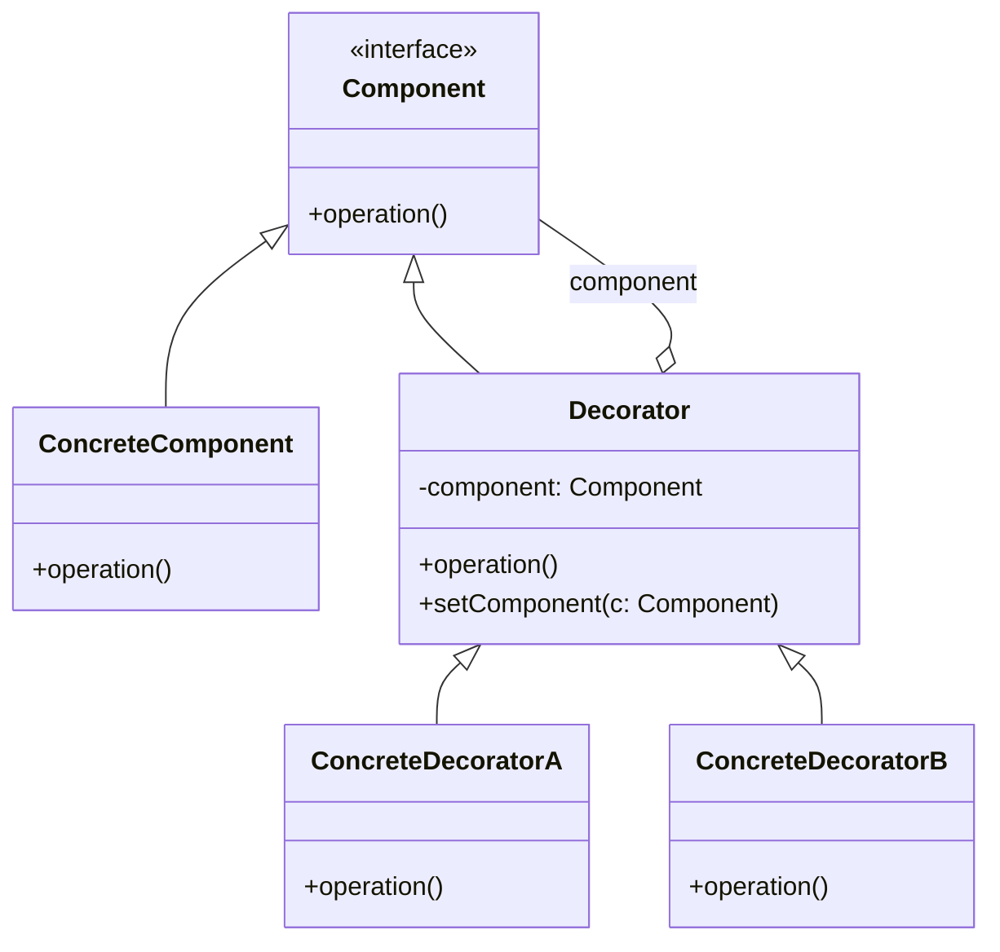

# Decorator Design Pattern — Example Implementation

This project demonstrates a simple implementation of the Decorator design pattern. The goal is to show how behavior can be added to individual objects at runtime without affecting other objects from the same class.

## Quick overview
- Component: defines the interface for objects that can have responsibilities added dynamically.
- ConcreteComponent: a basic implementation of the component.
- Decorator (abstract): maintains a reference to a Component and implements the Component interface.
- ConcreteDecorators: extend Decorator to add responsibilities.

## Files / Classes (typical)
- Component (interface or abstract class) — operation()
- ConcreteComponent — basic implementation of operation()
- Decorator (abstract) — holds a reference to Component, delegates operation()
- ConcreteDecoratorA — adds behavior before/after delegating to the wrapped component
- ConcreteDecoratorB — adds other behavior

## Class diagram (Mermaid)

